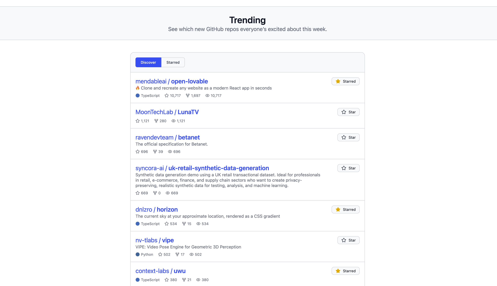

# Redcare Coding Challenge

## Demo

https://olivermicke.github.io/redcare-coding-challenge/

## Installation instructions

Recommended Node version: `v20.16.0`

    pnpm install

    # TanStack Router type definitions are generated when starting the dev server.
    pnpm dev

## Technical decisions

This app is a SPA built with [Vite](https://vite.dev/). It uses [TanStack Router](https://tanstack.com/router/latest) for type-safe routing and [TanStack Query](https://tanstack.com/query/latest) for state management, which is persisted to local storage. React Context serves as a dependency injection container for the API client, enabling easy testing without mocks and clean separation of concerns.

## Screenshots

### Repository Discovery View

### Starred Repositories View

